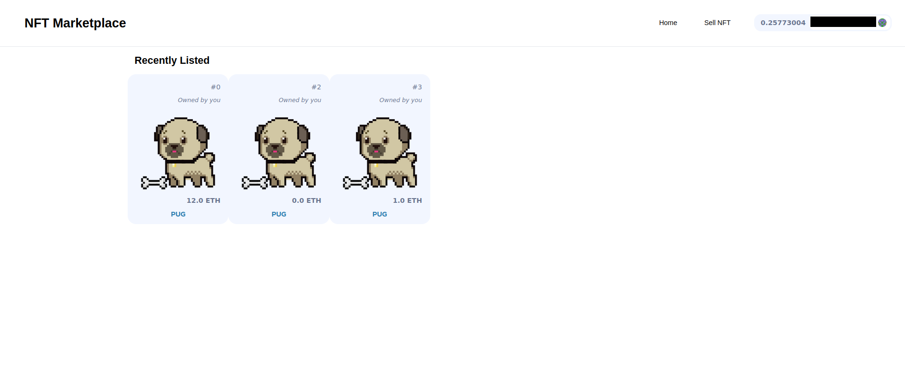
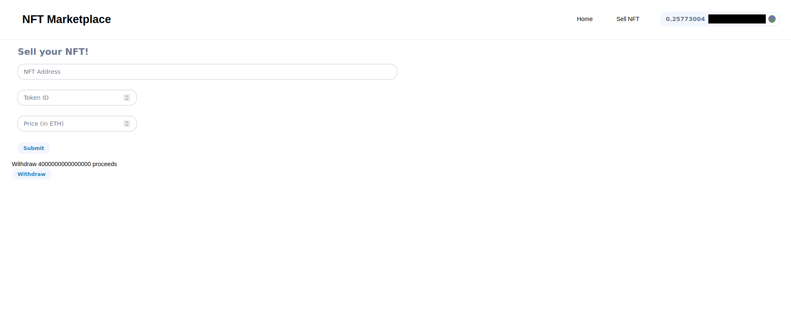
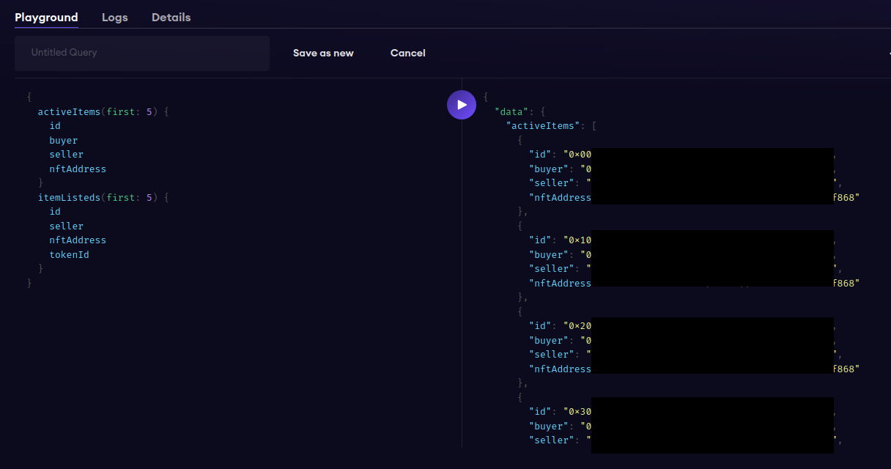

# Decentralized NFT Marketplace

## Setup

Install the Ipfs app using the next link [IPFS](https://ipfs.tech/#install).

Run **yarn run dev** in the frontend folder and now you should be able to see the website.

To change the price listing click on the wanted nft and set a new value, approving the transaction by using the Metamask Wallet.

Go and sell the NFTs at the **/sell-nft** page, fill the right data and then withdraw the funds received from the sale.

To recreate deploy the BasicNft and NftMarketplace contract using **yarn hardhat deploy --network 'your choice'** (if you do it on localhost you need to run your own node using **hh node**).

To set up the subgraphs just deploy the subgraph folder using [TheGraph Protocol website](https://thegraph.com/explorer). It should look something like this:

The subgraphs are only possible to be deployed on some testnets and mainnets, the only way to deploy on localhost would be to run the graph node on the terminal using https://github.com/graphprotocol/graph-node .

## Events caught by the subgraph deployed on Goerli Testnet using TheGraph Protocol

>- <value>1. `listItem`: List NFTs on the marketplace

>- <value>2. `buyItem`: Buy the NFTs

>- <value>3. `cancelItem`: Cancel a listing

>- <value>4. `updateListing`: Update Price

>- <value>5. `withdrawProceeds`: Withdraw payment for any bought NFTs
